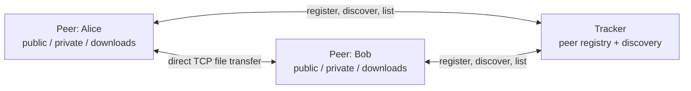

# Pair with Peer

> A small C++17 file-sharing app with tracker-assisted discovery and direct peer-to-peer transfers.

[](https://github.com/peprick/Pair-With-Peer/actions/workflows/build.yml)


Pair with Peer is an approachable networking project that keeps the control plane and data plane separate: a lightweight tracker helps peers find one another, then the peers exchange files directly over TCP.

## Highlights

- Direct TCP file transfers between peers—file data never passes through the tracker
- Public file discovery across all currently reachable peers
- Direct file sending to a named peer
- A friendly command interface with clean registration and shutdown
- Bounded, network-byte-order protocol messages with complete send/receive handling
- Safe file names, temporary download files, and collision-free destinations
- Configurable addresses and isolated data directories for easy local demos
- Builds cleanly with Apple Clang and GCC-compatible C++17 compilers

## Architecture



The tracker stores peer names and reachable addresses. For a public download, it asks registered peers whether they have the requested file and returns the first matching peer. The downloader then opens a new connection directly to that peer.

## Quick start

You need a C++17 compiler and `make`. On macOS, install the Xcode Command Line Tools; on Debian or Ubuntu, install `build-essential`.

Build the project:

```sh
git clone https://github.com/peprick/Pair-With-Peer.git
cd Pair-With-Peer
make
```

Then open three terminals from the repository directory.

**Terminal 1 — start the tracker**

```sh
./bin/pwp-tracker
```

**Terminal 2 — share a file as Alice**

```sh
mkdir -p peers/alice/public
printf 'Hello from Alice!\n' > peers/alice/public/hello.txt
./bin/pwp-peer --name alice --listen 127.0.0.1:9001
```

**Terminal 3 — connect as Bob**

```sh
./bin/pwp-peer --name bob --listen 127.0.0.1:9002
```

At Bob's prompt:

```text
pwp> list
Available public files:
  alice (1)
    - hello.txt
pwp> get hello.txt
Downloaded from alice -> peers/bob/downloads/hello.txt
```

That's the whole path: discovery through the tracker, transfer directly from Alice to Bob.

## Peer commands

| Command | What it does |
| --- | --- |
| `list` | Lists public files offered by reachable peers |
| `get <filename>` | Downloads a public file into `downloads/` |
| `send <peer> <filename>` | Sends a file from `private/` to an opted-in peer's `inbox/` |
| `status` | Shows the tracker, listening address, and data directories |
| `help` | Prints the available commands |
| `quit` | Unregisters from the tracker and exits cleanly |

Each peer gets an isolated directory:

```text
peers/<name>/
├── public/      # files advertised through `list` and `get`
├── private/     # source files for `send`
├── downloads/   # completed public downloads
└── inbox/       # completed direct sends
```

The directories are created automatically when a peer starts. Existing files are never silently overwritten; a numeric suffix is added when needed.

Incoming direct sends are disabled by default. A receiving peer must opt in explicitly:

```sh
./bin/pwp-peer --name bob --listen 127.0.0.1:9002 --accept-direct
```

## Configuration

```text
Usage: pwp-peer --name NAME --listen HOST:PORT [options]

  --name NAME            Unique peer name
  --listen HOST:PORT     Local address for incoming connections
  --tracker HOST:PORT    Tracker address (default: 127.0.0.1:8080)
  --advertise HOST:PORT  Reachable address announced to other peers
  --data-dir PATH        Peer data directory (default: peers/NAME)
  --accept-direct        Accept direct sends into inbox/ (off by default)
```

The tracker accepts `--listen HOST:PORT` and defaults to `0.0.0.0:8080`.

For a LAN demo, bind each peer to its LAN address. If a peer listens on `0.0.0.0`, pass its reachable address separately:

```sh
./bin/pwp-peer \
  --name alice \
  --listen 0.0.0.0:9001 \
  --advertise 192.168.1.20:9001 \
  --tracker 192.168.1.10:8080
```

## Development

The default Make targets cover the common work-flow:

```sh
make              # build bin/pwp-tracker and bin/pwp-peer
make test         # run protocol and file-transfer tests
make test-e2e     # run a real tracker + two-peer smoke test
make format       # format C++ sources with clang-format
make clean
```

CMake is also supported:

```sh
cmake -S . -B build -DCMAKE_BUILD_TYPE=Release
cmake --build build
ctest --test-dir build --output-on-failure
```

See [CONTRIBUTING.md](CONTRIBUTING.md) for the contribution workflow and [docs/PROTOCOL.md](docs/PROTOCOL.md) for the wire protocol.

## Scope and security

Pair-With-Peer is an educational LAN-oriented project, not a production file-sharing service. It currently has no authentication, encryption, content integrity hashes, NAT traversal, resumable transfers, or multi-source chunk downloading. Run it only with peers you trust and on networks where direct peer connections are appropriate.

The implementation does validate message sizes and file names, caps files at 1 GiB, applies socket-timeouts, writes downloads through unique temporary files, prevents silent overwrites, isolates peer data by directory, and keeps direct sends opt-in. Those safeguards improve reliability; they do not turn the protocol into a secure transport.

## Roadmap

- Authenticated peers and encrypted transport
- Content hashes and post-download verification
- Peer liveness/heartbeat tracking
- Resumable and multi-source chunk transfers
- A small terminal UI for live transfer progress

Contributions are welcome—especially focused improvements with a test that demonstrates the behavior.
